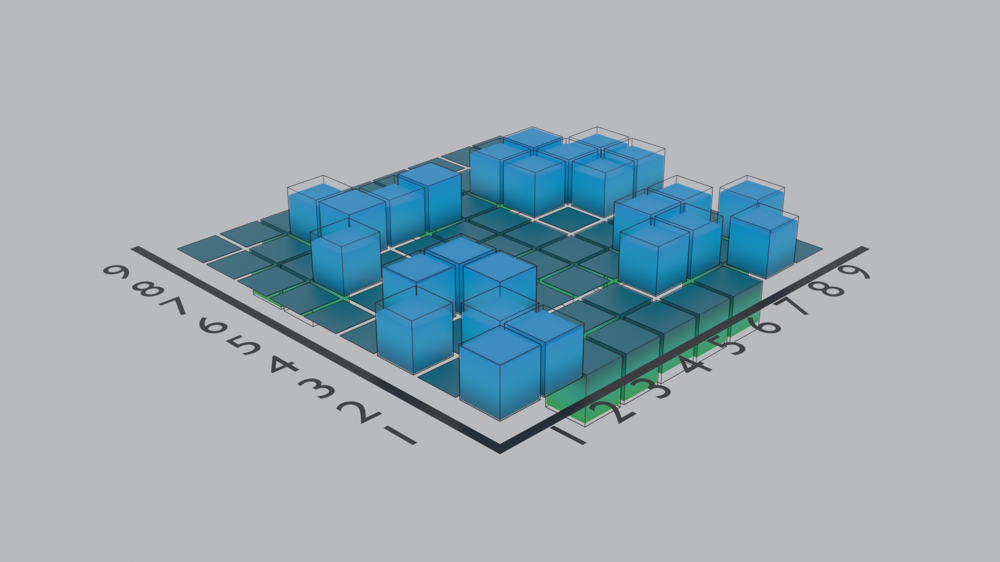

# BlendVis: Blender Visualization Tool for 3D Scientific Plotting 


## Quick Start
`BlendVis` is designed to mimic the `matplotlib.pyplot` library, with the aim that it is as easy as possible to use.
The library uses the powerful, open-source 3D modelling software [Blender](https://www.blender.org/) as a backend.


## Examples
```
# Simulate some experimental and theoretical data
M, N = 10, 10
x, y = np.arange(1, M), np.arange(1, N)
X, Y = np.meshgrid(x, y)
Z = np.random.uniform(-1, 1, [M, N])

# Use the BlendVis library to generate a 3D barplot Blender scene based on the data
import blendvis
ax = blendvis.Axes()
ax.barplot(X, Y, Z)
ax.save()
```
which will save the following image,


## Installing
Currently, to use `BlendVis`, it needs to be run through Blender. 
First [download](https://www.blender.org/download/) and install Blender (the 2.93 LTS is recommended).
It is easiest to copy-paste one of the example .blend files and start from there.

## Limitations
This module is a work in progress. Currently, 3D barplots are the only chart type implemented.